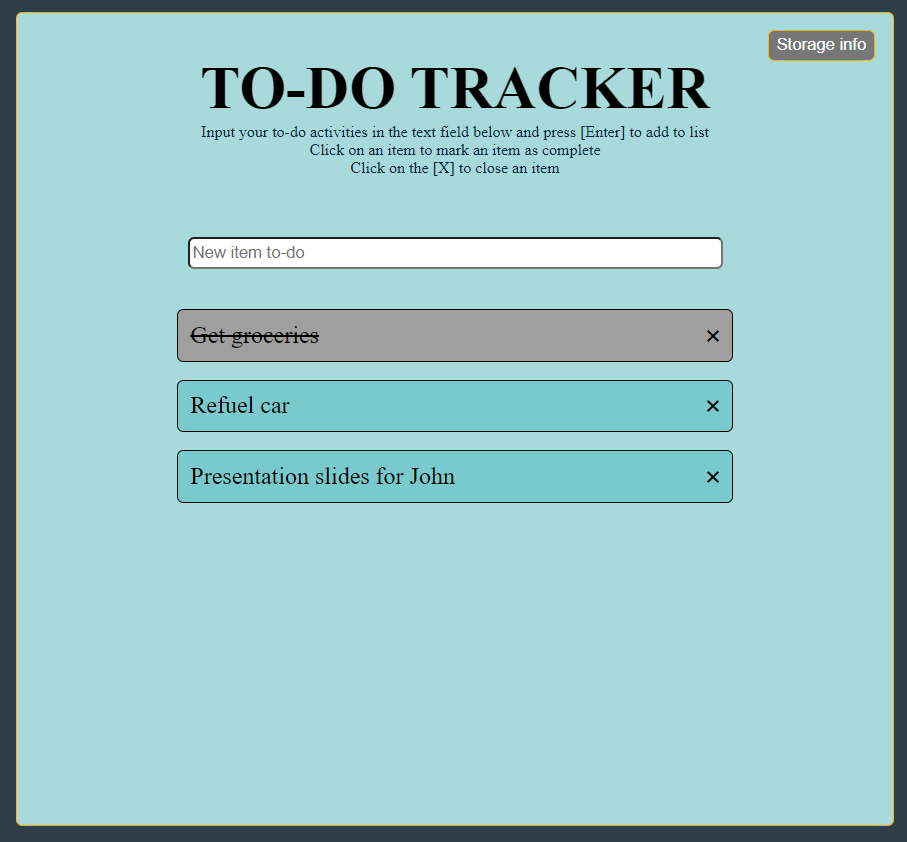

# todo_tracker
To-do tracking list that stores data locally. So that you never lose your unclosed/undone to-do items.

 
 
Once items are marked as done or closed, they will no longer be retrieved if you refresh the page/restart your browser/restart your OS.
 
If you ever want to clear all data, you may clear it from your browser or simply open up your browser console and entering  
 
localStorage.clear()
  
 
Hope this app is able to help you out!
